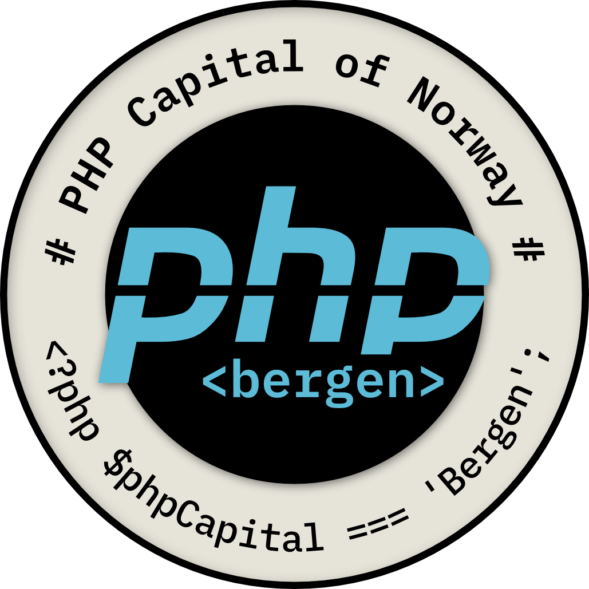

# Velkommen til Drupal-kurs

I dette kurset gir vi en innføring i bygging av nettsider og webutvikling med [Drupal](https://drupal.org). Vi tar utgangspunkt i [Drupal CMS](https://drupal.org/drupal-cms), men ingenting er i veien med å bruke ditt eget Drupal nettsted eller en annen Drupal variant gjennom kurset.

Målet med kurset er at du skal lære de grunnleggende byggeklosser vi har Drupal og gi deg et godt grunnlag for utforskning og videre læring.

* [Dag en](dag1/plan_dag_1.md)
* [Dag to](dag2/plan_dag_2.md)
* [Dag tre](dag3/plan_dag_3.md)

## En kort historie om Drupal

Det hele startet i år 2000, da en belgisk student ved navn Dries Buytaert ville lage et enkelt forum for å holde kontakten med venner etter studiene. Han utviklet et lite system som lot dem dele innlegg og nyheter. Systemet ble først kalt "dorp", som betyr "landsby" på nederlandsk, men en stavefeil førte til at domenet ble registrert som drupal.org, basert på det engelske uttalen av "druppel" (nederlandsk for "dråpe").

I 2001 bestemte Dries seg for å dele programvaren med verden som open source. Slik ble Drupal født – et fleksibelt og kraftig publiseringssystem som etter hvert skulle vokse langt utover et lite studentnettsted.

Drupal skilte seg ut fra andre CMS-er (Content Management Systems) ved å være modulært og svært tilpasningsdyktig. Det tok ikke lang tid før både utviklere og større organisasjoner fikk øynene opp for plattformen.

I løpet av de neste tiårene ble Drupal brukt av alt fra små nettsamfunn til store institusjoner som FN, Det hvite hus og universiteter over hele verden. Det utviklet seg til en av de mest robuste og skalerbare CMS-løsningene som finnes – og drives fortsatt av et engasjert, globalt fellesskap av utviklere.
