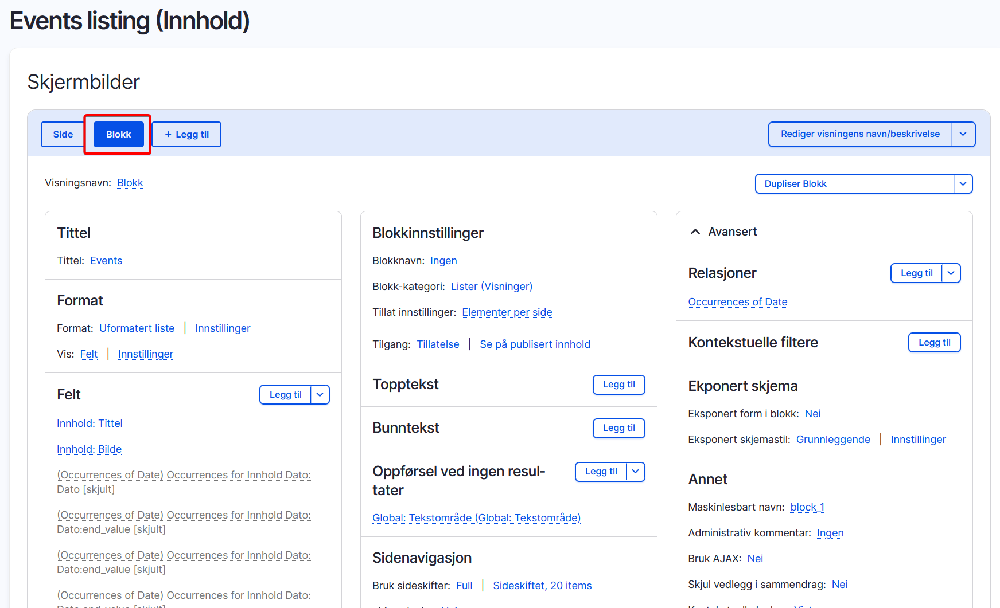

# Blokker (block)

### Typer blokker

**Blokker er innholdskomponenter som kan plasseres inn i forhåndsdefinerte regioner på en nettside.**

- En blokk kan være alt fra en meny, en søkeboks, en liste med blokker eller er snutt med ren HTML-kode.
- Blokker kan kobles til regioner i themet, som for eksempel footer, header eller content. Mer om regioner i del 3 av kurset...
- Vi kan sette regler for hvor blokkene skal vises og når de skal vises. For eksemepl bare på forsiden, kun på nyhetssaker eller på alle sider.
- Blokker er på samme måte som noder en content entity og du kan lage så mange typer blokker som du ønsker.
- Blokker kan på samme måte som noder inneholde felt (fieldsable).

## Typer blokker:

**Systemblokker**

Ferdiglagde blokker som kommer fra Drupal eller moduler. For eksempel: 
- søkefelt, 
- branding
- hovedmeny.

**Tilpassede blokker**

Blokker som man har opprettet selv, enten ekle blokker med bare html-kode eller mer komplekse blokker med flere felter.
Gå til: `/admin/structure/block-content`

**Automatisk genererte blokker**

Blokker som i sin natur er har mere dynamisk innhold. Skapes av moduler sitt innhold og eller konfigurasjon. For eksempel er en blokk som Views modulen hvor man kan lege en samling av innhold som vises i en blokk
