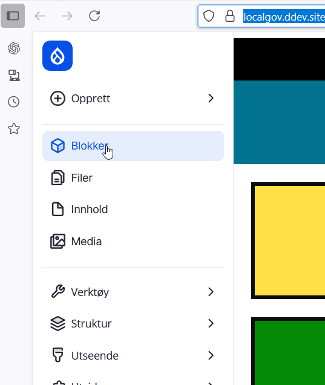
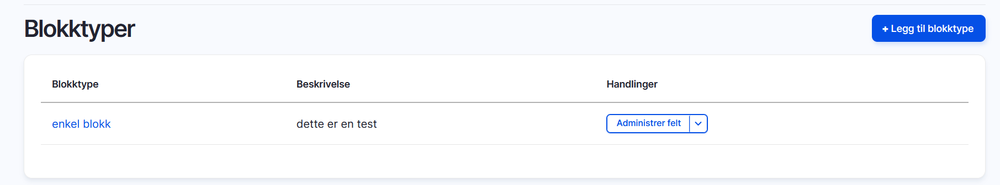
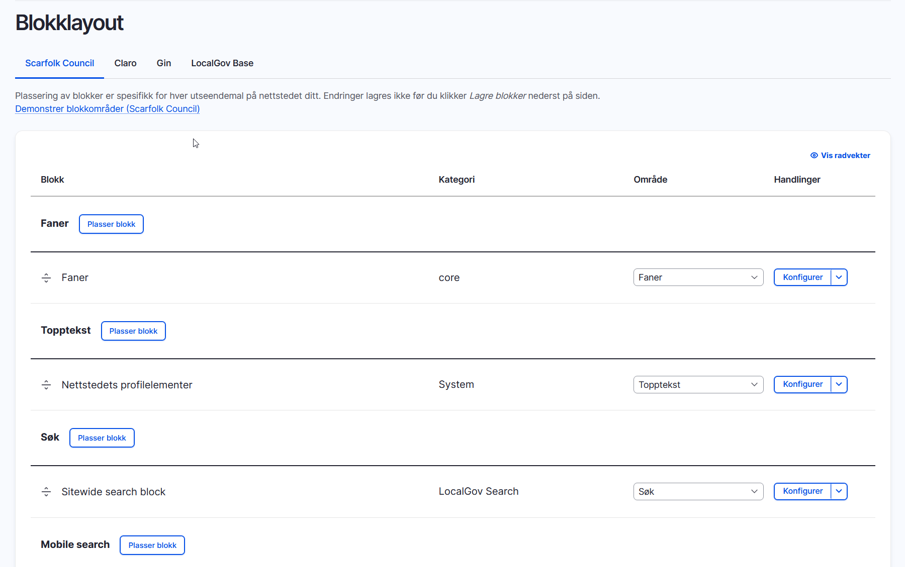
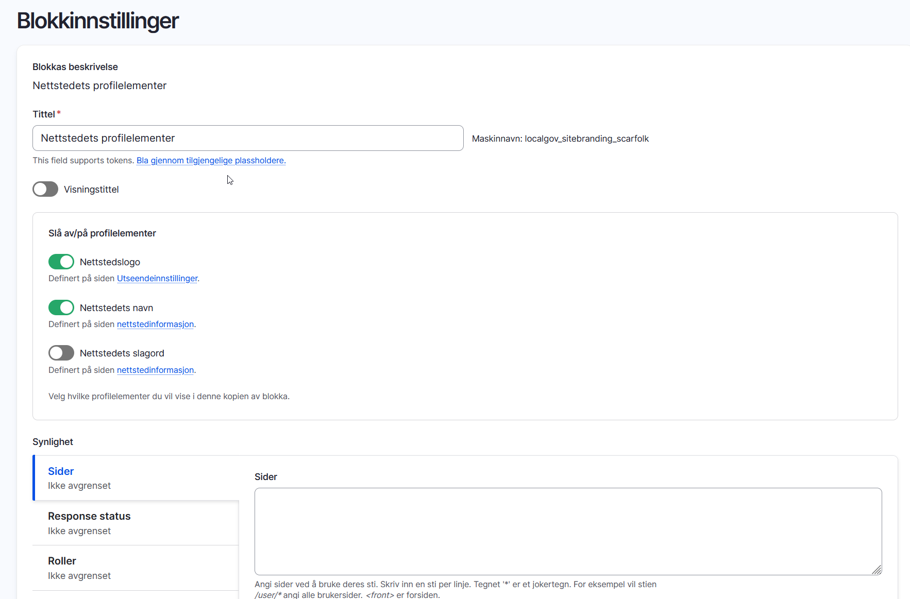

# Blokker (block)

**Blokker er innholdskomponenter som kan plasseres inn i forhåndsdefinerte regioner på en nettside.**

- En blokk kan være alt fra en meny, en søkeboks, en liste med blokker eller er snutt ne ren HTML-kode.
- Blokker kan kobles til regioner i themet, som for eksempel footer, header eller content.
- Vi kan sette regler for hvilke sider blokkene skal vises, for eksemepl bare på forsiden, kun på nyhetssaker eller på alle sider.

## Typer blokker:

**Systemblokker**

Ferdiglagde blokker som kommer fra Drupal eller moduler. 
Dette er for eksempel søkefelt, branding, hovedmeny.

**Tilpassede blokker**

Blokker som man har opprettet selv, enten ekle blokker med bare html-kode eller mer komplekse blokker med flere felter.

**Automatisk genererte blokker**

Blokker som er generert fra en modul, for eksempel views hvor man kan lege en samling av innhold som vises i en blokk

