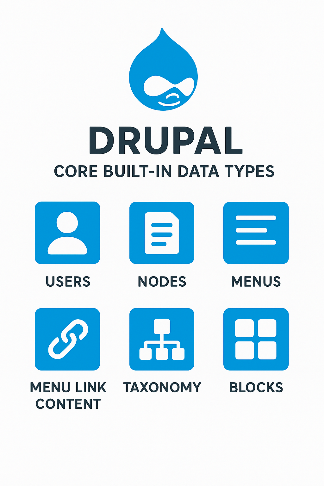

# Drupal og byggeblokker for innhold

## Innholdsobjekter (content entities)

* Brukere (users) - Idenfisering, grupper og rollebasert tilgang.
* Noder (nodes) - Artikkler, sider.
* Taksonomi (taxonomy, vacabularies) - Klassefisering og kategorier.
* Blokker og innholdsblokker.
* Kommentarer og meldinger
* Filer - bilder, videoer, dokumenter.
* ... og mange flere.

De har alle ulike egenskaper og funksjoner men de aller flest kan se på som en enhet som inneholder forskjellige type data felt. Drupal core kommer med en et standardutvalg av content entities. Ekstra moduler kan legge til sine egne. Om ingen tidlgere har laget noe som plasser, lag din egen.

## [Hva er felt?](fields.md)
