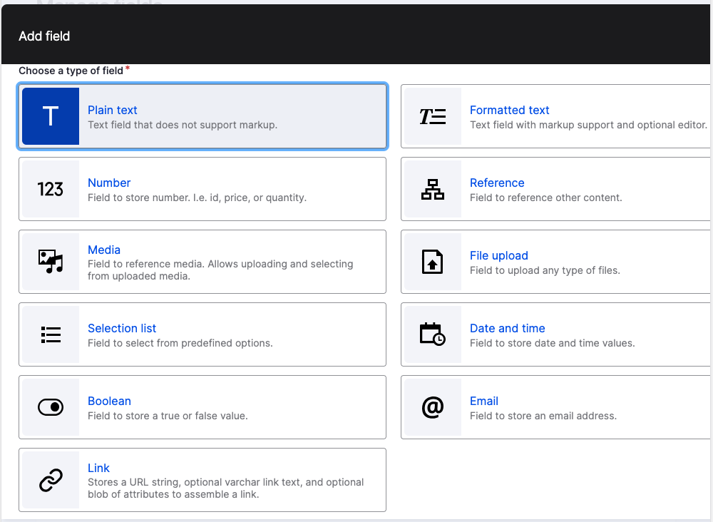
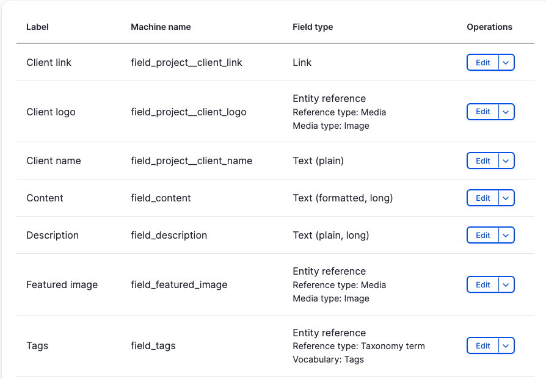

# Felt (fields)

## Eksempel fra en node

## Hva er felt

Felter er hvor data som blir skapt blir lagret. Data blir lagret sammen med konfigurasjon i databased.

## Live demo

Gå til: `/admin/structure/types`
