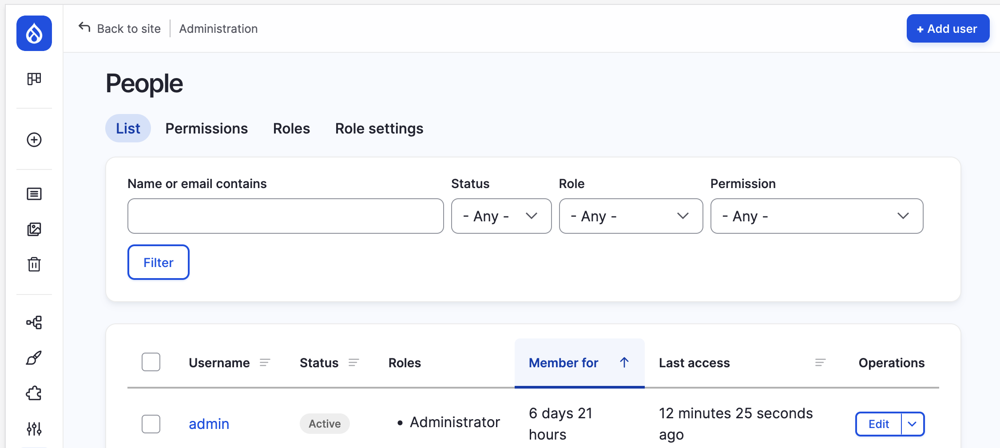
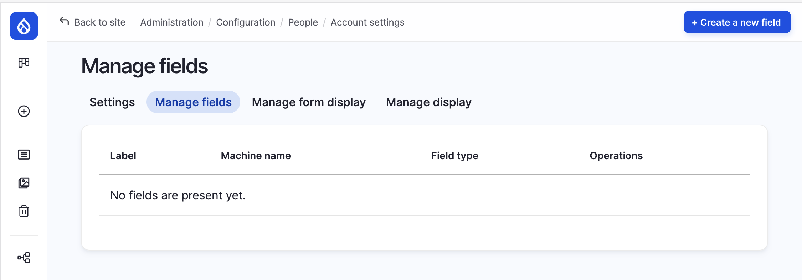

# Brukere (user entity)

Er på samme måte som noder, en entity type i Drupal. Den har som ansvar for sikkerhet og rettigheter. Brukere er altså innhold som har sine egne egenskaper.

* Pålogging (authentication) - Der du må bevise at du er den du er. Brukerkonto lokalt i Drupal eller ved single signon (SSO) som Google, Facebook, Altinn, FEIDE osv.
* Kontroll av rettigheter for din bruker ofte, men ikke nødvendigvis, basert på din brukerrolle. Drupal har en veldig finmasket rettighetsmodell. Ekstra moduler legger til egne rettigheter. Trenger du dine egne, kan disse og skapes.
* Brukere kan tilhøre en eller flere grupper. Du kan ha så mange brukergrupper du bare vil. Ingen begrensning.
* Brukerkontoer kan ha mange felt (fieldable), på samme måte som andre content entities som f.eks noder eller taxonomy terms.

## Demo - Brukeradministrasjon

Gå til: `/admin/people`

## Demo - Kontoinstillinger

Gå til: `/admin/config/people/accounts`

