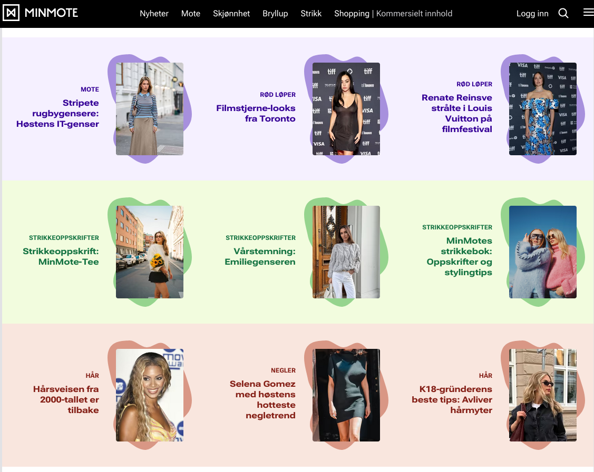
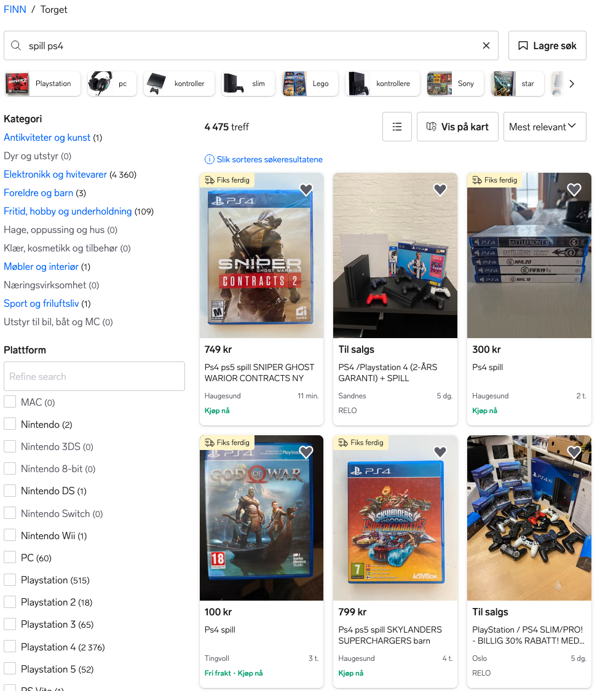
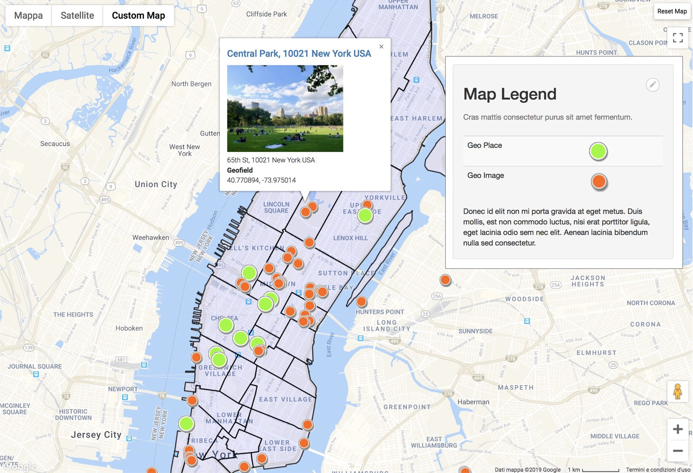
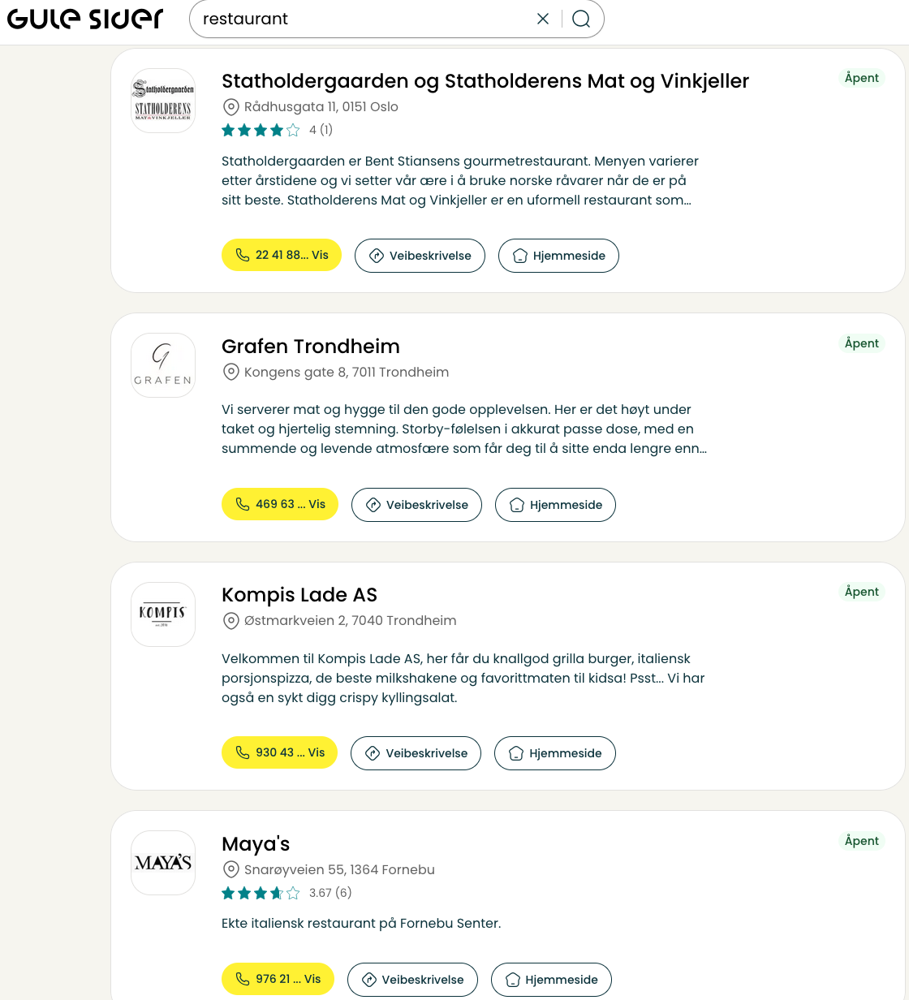
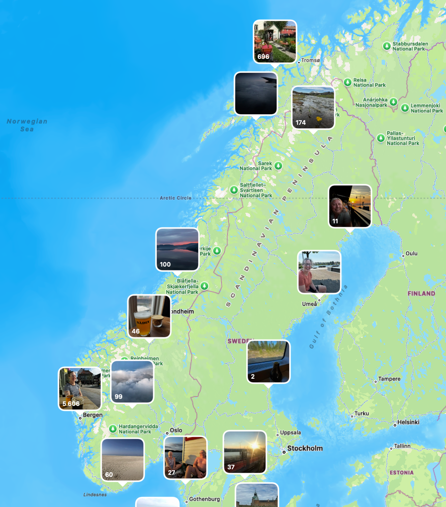
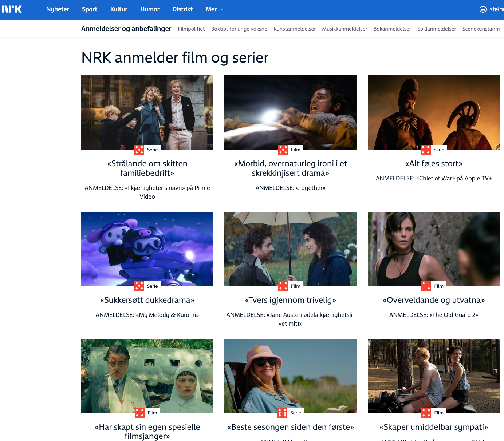
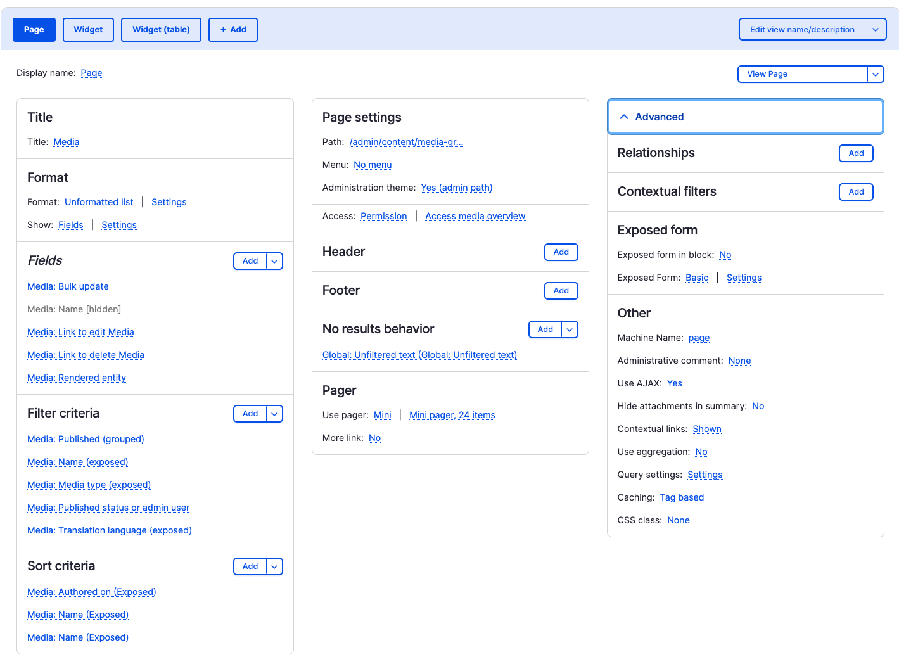

# Views

Mens man bygger et nettsted og skaper innhold melder og behovet for å andre måter og konsumere innholdet på enn og artikkel for artikkel f.eks. Man ønsker å skape blokker med lister av innhold eller bare rene gallerier av bilder med overskrifter. Views er ditt verktiøy for alle slike behov. Det er Drupal sin arbeidshest for alle slike behov. Om man tenker seg om er mye man ser lister, man kanskje bare ikke tenker på det som lister.

## Eksempler på innholdslister

## Views mere detaljert

Views er et grafisk grensesnitt for å skape spørringer etter et sett data. Det samme settet med data kan så vises på forskjellige måter. Views har mulighet til å hvise samme data på forskjelige måter. Data kan og eksponeres som strukturert data som csv, excel, json osv. om man ønkser å jobbe videre med dataene i andre programmer.

## Demo

Path: '/admin/structure/views'
