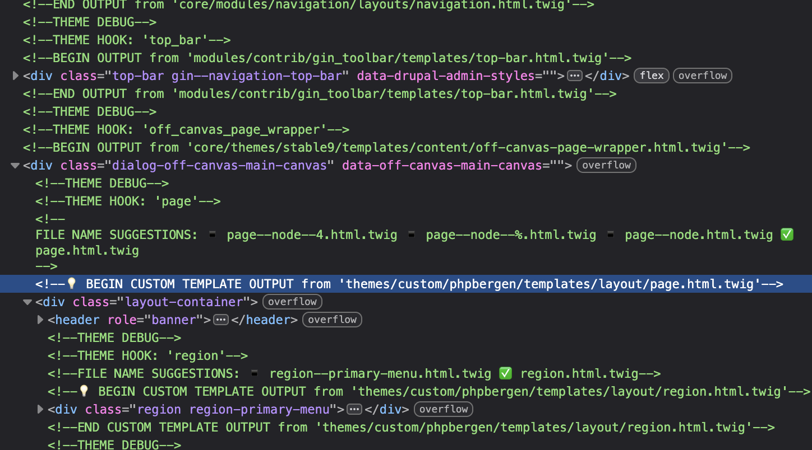

# Kom i gang med Twig

Vær oppmerksom på mellomlagring (caching). Cache kan slettes på `/admin/config/development/performance`

`ddev drush cr`

## Debugging Twig

Drupal debugging [official documentation](https://www.drupal.org/docs/develop/theming-drupal/twig-in-drupal/debugging-twig-templates).

```shell
cp web/sites/example.settings.local.php web/sites/default/settings.local.php
```

* Rediger `settings.php` i bunnen av filen.
* Rediger `development.services.yml` filen.

```yaml
parameters:
  twig.config:
    debug: true
    auto_reload: true
```

Slett alle mellomlagrer (caches) og du skal se noe slik i nettleseren sin inspektor.


